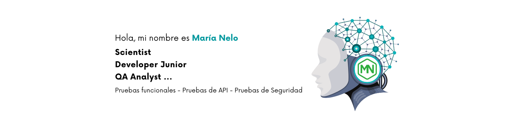

<!-- Banner -->

  

<h1 align="left">¡Hola! Soy María Nelo 👋</h1>

  Scientist · Junior Developer · QA Analyst · Pentester Junior · Ethical Hacker

---
### 👩‍🔬 Sobre mí  
Soy Doctora en Bioquímica y Biología Molecular, y he decidido combinar mi formación científica con el mundo del desarrollo, la analítica de calidad y la ciberseguridad.  
Me encanta asegurar que el software cumple los más altos estándares. Actualmente...

- 📍 Madrid, España  
- 🔗 [LinkedIn](https://www.linkedin.com/in/m4r14n3l0/)  
- 🧪 Intereses: Ciencia • QA • Ética hacker • Forense • Desarrollo

---

### 🧰 Toolbox (mi caja de herramientas)  
**Dev / QA:** Java · Python · C# · Git · HTML · CSS · JavaScript · Postman  
**Red Team / Pentesting:** nmap · dirsearch · Metasploit · Burp Suite · John the Ripper
<!-- **OSINT / Forense:** Shodan · Sherlock  -->
**Sistemas Operativos:** Kali Linux · Windows · macOS

---

### 🗂️ Proyectos destacados  
- **[M4R14-N3l0](https://github.com/M4R14-N3l0/M4R14-N3l0)** — Mi perfil.  
- **[My-Manga-Collection](https://github.com/M4R14-N3l0/My-Manga-Collection)** — Mi proyecto final de DAM, mi primera app oficial.
- **[POUR](https://github.com/M4R14-N3l0/POUR)** — Web estática accesible, un proyecto de accesibilidad.

---

### 📊 Mis estadísticas  

  

  

  

